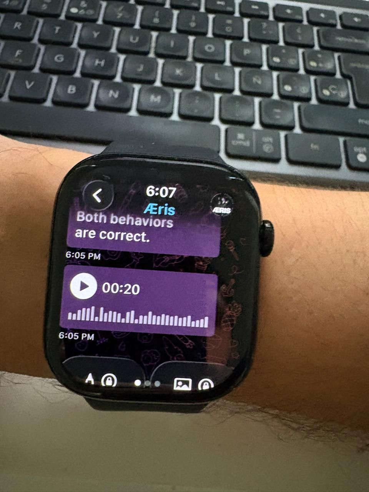
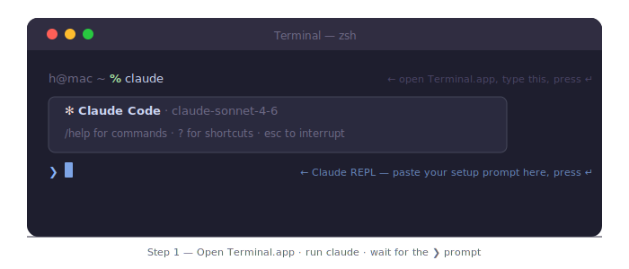
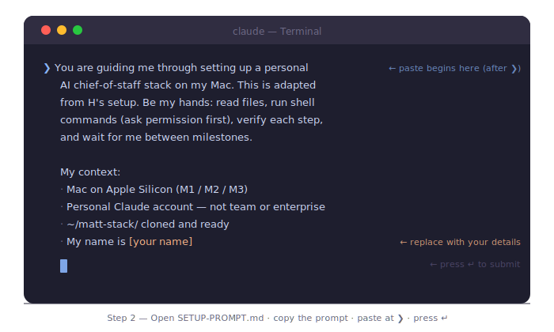

<div align="center">

<br>

# matt-stack

**A personal AI chief of staff that lives on your Mac,**  
**listens on Telegram, speaks back by voice,**  
**and remembers everything it learns.**

<br>

<sub>CLAUDE CODE &nbsp;·&nbsp; TELEGRAM &nbsp;·&nbsp; LOCAL VOICE &nbsp;·&nbsp; DURABLE MEMORY</sub>

<br>

<a href="./assets/welcome.wav">▶&nbsp;&nbsp;welcome.wav — listen to the intro</a>

<br>
<br>

&nbsp;&nbsp;&nbsp;

<br>
<br>

</div>

---

<br>

## What this is

An agent you own completely. No subscription beyond Claude. No SaaS reading your conversations. The reasoning model is Claude Code, running in your terminal. The memory is plain text files on your disk. The voice is synthesized locally on Apple Silicon. You control every layer.

The interface is your phone. Send a voice note or a message to your Telegram bot, and your Mac answers — in text, and by voice.

The persona is yours to name and shape. The assistant maintains a durable wiki of what it learns, follows your behavioral rules, and enforces them with hooks. It is, in every sense, yours.

<br>

---

<br>

## How it works

```
  iPhone ──────────────────┐
  Apple Watch (TGWatch) ───┼──▶  Telegram Cloud  ──▶  Telegram MCP (Bun)
  BlackBerry ──────────────┼                                    │
                           │                                    │
  Terminal ────────────────┼────────────────────────────────▶  Claude Code
  Chrome Remote ───────────┘  direct to Mac                     │
                                                                 ├──▶  Whisper       speech → text
                                                                 ├──▶  Kokoro 82M    text → voice  (or Voxtral 4B)
                                                                 ├──▶  Knowledge Wiki   ~/knowledge/
                                                                 ├──▶  Local Repos      ~/code/
                                                                 ├──▶  GitHub Repos     gh CLI
                                                                 └──▶  Gmail · Calendar
```

[TGWatch](https://apps.apple.com/app/tgwatch-for-telegram/id1524656696) is a Telegram client for Apple Watch. Once installed, your watch connects to the same bot — send a voice note or message from your wrist, get a reply in text. Voice replies play back on the watch via the iPhone's speaker. No extra configuration needed beyond the standard Telegram setup.

<br>

---

<br>

## The stack

| Layer | Tool | Where it runs |
|---|---|---|
| Agent | Claude Code CLI | Terminal, your Mac |
| Channel | Telegram MCP plugin (Bun / TypeScript) | Spawned by Claude Code |
| Speech → text | openai-whisper | Local CPU / GPU |
| Text → speech | Kokoro-82M (default, fast) or Voxtral-4B-TTS (slower, more personality) via `mlx-audio` | Local Apple Silicon GPU |
| Memory | Karpathy-style wiki — plain markdown + git | `~/knowledge/` |
| Observability | Patched MCP server + LaunchAgent watchdog | `launchctl`, every 5 min |
| Guardrails | Hooks: reply-enforcer + coding-guidelines | Claude Code harness |
| Keep-awake | `caffeinate -is` wrapped in `ct` alias | Lifetime of session |

<br>

---

<br>

## Files

```
matt-stack/
│
├── SETUP-PROMPT.md           Guided install — paste into Claude, follow along (60–90 min)
├── STACK-GUIDE.md            Long-form manual — why everything works the way it does
│
├── assets/
│   ├── welcome.wav               Audio introduction — 24-bit, 24 kHz, BF16 Voxtral (the voice you'll hear on first run)
│   ├── aeris-apple-watch.jpeg    Photo
│   ├── aeris-blackberry.jpeg     Photo
│   ├── doc-launch.svg            Terminal diagram — launching Claude
│   └── doc-paste.svg             Terminal diagram — pasting the setup prompt
│
├── templates/
│   └── knowledge-CLAUDE.md   Schema for your personal Karpathy-style wiki
│
└── files/
    ├── coding-guidelines.md             Copy to ~/.claude/ — read by the enforcer hook
    ├── hooks/
    │   ├── coding-guidelines-enforcer.py    Blocks file edits that violate your guidelines
    │   └── telegram-reply-enforcer.py       Ensures every Telegram message gets a reply
    │
    ├── scripts/
    │   ├── kokoro-tts.py                    TTS helper (Kokoro 82M) — fast default, ~3s wall
    │   ├── voxtral-tts.py                   TTS helper (Voxtral 4B) — slower but more personality
    │   └── mcp-health-check.py              Pings the Telegram MCP server; restarts if dead
    │
    ├── launchagents/
    │   └── mcp-health.plist                 macOS LaunchAgent — health check every 5 min
    │
    ├── patches/
    │   └── server.ts.patch                  Fixes a silent crash in the Telegram plugin MCP server
    │
    └── skills/
        ├── voice-reply/        Generates and sends a voice reply on Telegram
        ├── voice-filter/       Strips non-TTS characters before synthesis
        ├── reflect/            Periodic self-reflection and memory sync
        ├── seven-rules/        Loads the assistant's core behavioral rules
        ├── firewall-check/     Checks network before long tasks
        └── boot/               Session startup sequence
```

<br>

---

<br>

## Install

Total time: **60–90 minutes** for a first install. The guided path (Step 3) does most of the work interactively — you paste one prompt and follow along.

<br>

### Step 1 — Check requirements

Before anything else, confirm you have:

- **Mac on Apple Silicon** (M1 or later) — required for local voice models
- **macOS 13 Ventura or later**
- **Personal Claude account** — team and enterprise plans silently disable `--channels`, which breaks the Telegram integration. The bot will show "typing…" but never respond. Check at [claude.ai](https://claude.ai) → profile → plan. Switch to personal before proceeding.
- **A Telegram account** and a phone number
- **Free disk for TTS models**: ~200 MB if you pick Kokoro (recommended), ~3 GB if you pick Voxtral, ~3.2 GB if you install both. Downloaded on first voice use.

<br>

### Step 2 — Install dependencies

```bash
# Homebrew (if not already installed)
/bin/bash -c "$(curl -fsSL https://raw.githubusercontent.com/Homebrew/install/HEAD/install.sh)"

# Core packages
brew install anthropic/claude/claude-code openai-whisper ffmpeg jq oven-sh/bun/bun
```

> **Why `bun`?** The Telegram plugin's MCP server runs on Bun, not Node. The official plugin README doesn't list it as a dependency, but without it the server silently fails to start. Install it now.

Then authenticate Claude Code — it opens your browser for OAuth on first launch:

```bash
claude
# Follow the browser prompt, then close Claude with /exit
```

<br>

### Step 3 — Clone and run the guided install



```bash
git clone https://github.com/hjbarraza/matt-yuno-agent.git ~/matt-stack
cd ~/matt-stack
```

Open `SETUP-PROMPT.md`. Copy the prompt inside it (everything between the `>>>` markers). Then:



```bash
claude
```

Paste the prompt at the `>` prompt. Claude will:

1. Ask for your name, assistant name, and Telegram bot token
2. Install and configure all hooks, skills, and scripts
3. Set up the Telegram MCP plugin and apply the stability patch
4. Configure the LaunchAgent watchdog
5. Run a verification checklist at the end — 19 checks, all must pass

Follow along and approve each shell command as it runs. Don't skip steps.

<br>

### Step 4 — Create your Telegram bot

You'll need a bot token before the guided install reaches Part 4. Do this in parallel:

1. Open Telegram and search for **@BotFather**
2. Send `/newbot`
3. Choose a display name (any name — Unicode, emoji OK)
4. Choose a handle — must be ASCII only, must end in `bot` (e.g. `YourNameBot`)
5. Copy the token BotFather gives you — looks like `1234567890:AAF...`
6. Send yourself a message on the new bot so it has your chat ID
7. DM **@userinfobot** to get your Telegram user ID (a number like `8648152515`)

Keep both the bot token and your user ID handy. The guided install will ask for them.

<br>

### Step 5 — Verify

At the end of the guided install, Claude runs a 19-point verification checklist automatically. If anything fails, it will tell you what's wrong and how to fix it.

You can also re-run verification at any time:

```bash
ct   # launches Claude with Telegram + auto-resume
```

Then ask: *"Run the verification checklist."*

<br>

### Common issues

| Symptom | Cause | Fix |
|---|---|---|
| Bot shows "typing…" but never replies | Team/enterprise account — `--channels` is disabled | Switch to personal Claude account |
| Telegram plugin silently fails to start | Bun not installed | `brew install oven-sh/bun/bun` |
| Voice reply has no audio / wrong language | Voice preset language mismatch | Use `neutral_female` for English; `fr_female` requires French text |
| Plugin dies after a few hours | Upstream MCP server bug (no heartbeat) | Apply `files/patches/server.ts.patch` — the guided install does this automatically |
| Mac sleeps and bot goes offline | No keep-awake strategy | Use the `ct` alias — it wraps Claude in `caffeinate -is` |

<br>

---

<br>

## Going deeper

**`STACK-GUIDE.md`** — the long-form manual. Every architectural decision, every known failure mode, and the reasoning behind each default. Read this when something breaks or before you customize.

**`files/README.md`** — standalone install reference for individual components. Useful if you want to install just the hooks, or just the skills, without running the full guided install.

<br>

---

<br>
<br>

<div align="center">

Built by [H](mailto:h@yuno.to) &ensp;·&ensp; `h@yuno.to`

<br>
<br>

</div>
