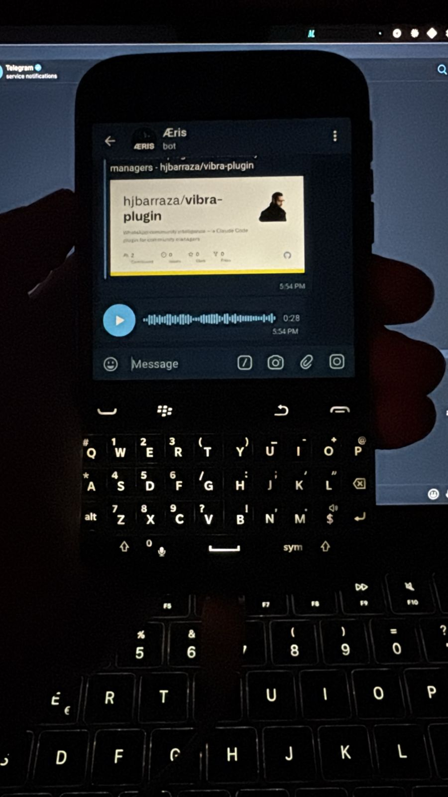

<div align="center">

<br>
<br>

&nbsp;&nbsp;&nbsp;

<br>
<br>
<br>

# matt-stack

<br>

**A personal AI chief of staff that lives on your Mac,**  
**listens on Telegram, speaks back by voice,**  
**and remembers everything it learns.**

<br>

<sub>CLAUDE CODE &nbsp;·&nbsp; TELEGRAM &nbsp;·&nbsp; LOCAL VOICE &nbsp;·&nbsp; DURABLE MEMORY</sub>

<br>
<br>

</div>

---

<br>

## What this is

An agent you own completely. No subscription beyond Claude. No SaaS reading your conversations. The reasoning model is Claude Code, running in your terminal. The memory is plain text files on your disk. The voice is synthesized locally on Apple Silicon. You control every layer.

The interface is your phone. Send a voice note or a message to your Telegram bot, and your Mac answers — in text, and by voice.

The persona is yours to name and shape. The assistant maintains a durable wiki of what it learns, follows your behavioral rules, and enforces them with hooks. It is, in every sense, yours.

<br>

---

<br>

## How it works

```
  iPhone ──────────────────┐
  Apple Watch (TGWatch) ───┼──▶  Telegram Cloud  ──▶  Telegram MCP (Bun)
  BlackBerry ──────────────┼                                    │
                           │                                    │
  Terminal ────────────────┼────────────────────────────────▶  Claude Code
  Chrome Remote ───────────┘  direct to Mac                     │
                                                                 ├──▶  Whisper       speech → text
                                                                 ├──▶  Voxtral 4B    text → voice
                                                                 ├──▶  Knowledge Wiki   ~/knowledge/
                                                                 ├──▶  Local Repos      ~/code/
                                                                 ├──▶  GitHub Repos     gh CLI
                                                                 └──▶  Gmail · Calendar
```

[TGWatch](https://apps.apple.com/app/tgwatch-for-telegram/id1524656696) is a Telegram client for Apple Watch. Once installed, your watch connects to the same bot — send a voice note or message from your wrist, get a reply in text. Voice replies play back on the watch via the iPhone's speaker. No extra configuration needed beyond the standard Telegram setup.

<br>

---

<br>

## The stack

| Layer | Tool | Where it runs |
|---|---|---|
| Agent | Claude Code CLI | Terminal, your Mac |
| Channel | Telegram MCP plugin (Bun / TypeScript) | Spawned by Claude Code |
| Speech → text | openai-whisper | Local CPU / GPU |
| Text → speech | Voxtral-4B-TTS via `mlx-audio` | Local Apple Silicon GPU |
| Memory | Karpathy-style wiki — plain markdown + git | `~/knowledge/` |
| Observability | Patched MCP server + LaunchAgent watchdog | `launchctl`, every 5 min |
| Guardrails | Hooks: reply-enforcer + coding-guidelines | Claude Code harness |
| Keep-awake | `caffeinate -is` wrapped in `ct` alias | Lifetime of session |

<br>

---

<br>

## Files

```
matt-stack/
│
├── SETUP-PROMPT.md           Guided install — paste into Claude, follow along (60–90 min)
├── STACK-GUIDE.md            Long-form manual — why everything works the way it does
├── welcome.ogg               Audio introduction to this stack
│
├── templates/
│   └── knowledge-CLAUDE.md   Schema for your personal Karpathy-style wiki
│
└── files/
    ├── coding-guidelines.md             Copy to ~/.claude/ — read by the enforcer hook
    ├── hooks/
    │   ├── coding-guidelines-enforcer.py    Blocks file edits that violate your guidelines
    │   └── telegram-reply-enforcer.py       Ensures every Telegram message gets a reply
    │
    ├── scripts/
    │   ├── voxtral-tts.py                   TTS helper — synthesizes WAV, converts to OGG opus
    │   └── mcp-health-check.py              Pings the Telegram MCP server; restarts if dead
    │
    ├── launchagents/
    │   └── mcp-health.plist                 macOS LaunchAgent — health check every 5 min
    │
    ├── patches/
    │   └── server.ts.patch                  Fixes a silent crash in the Telegram plugin MCP server
    │
    └── skills/
        ├── voice-reply/        Generates and sends a voice reply on Telegram
        ├── voice-filter/       Strips non-TTS characters before synthesis
        ├── reflect/            Periodic self-reflection and memory sync
        ├── seven-rules/        Loads the assistant's core behavioral rules
        ├── firewall-check/     Checks network before long tasks
        └── boot/               Session startup sequence
```

<br>

---

<br>

## Install

**Prerequisites.**&ensp;A Mac on Apple Silicon. A personal Claude account — team and enterprise plans silently disable the Telegram channel. Homebrew.

```bash
# 1. Clone
git clone https://github.com/hjbarraza/matt-stack.git ~/matt-stack

# 2. Install dependencies
brew install anthropic/claude/claude-code openai-whisper ffmpeg jq oven-sh/bun/bun

# 3. Authenticate Claude Code
claude
```

**Quick path — guided install in one conversation:**

Open `SETUP-PROMPT.md`, run `claude` in Terminal, paste the prompt. Claude will ask for your details and drive the rest — step by step, with verification at each milestone.

**Deep path — understand before you install:**

Read `STACK-GUIDE.md`. Every architectural decision is documented. Every known failure mode is covered.

<br>

---

<br>

## Requirements

- Mac on Apple Silicon — M1 or later
- macOS 13 Ventura or later
- Personal Claude account — not team or enterprise
- ~3 GB free disk for the Voxtral model (4-bit quantized, downloaded on first use)
- A Telegram account and a phone number

<br>

---

<br>
<br>

<div align="center">

Built by [H](mailto:h@yuno.to) &ensp;·&ensp; `h@yuno.to`

<br>
<br>

</div>
